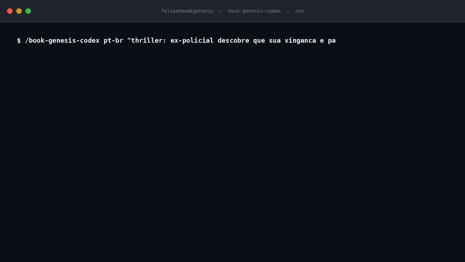

<div align="center">


# Book Genesis

### A multi-agent LLM pipeline for end-to-end content production with adversarial evaluation.

[](LICENSE)
[](#use-it-with-any-agent)
[](#system-architecture)
[](#evaluation-methodology)




</div>

---

## What this is

Most people building on LLMs hit the same wall: easy to generate text, hard to know if it's *good*. Book Genesis is my answer to that problem in one specific domain (long-form book production), but the architecture generalizes to any task where you need an LLM pipeline that produces output you can defend.

Built solo over 6 months. **10+ books shipped through the system in under 30 days.** MIT licensed, agent-agnostic (Claude Code, Codex, Antigravity, Kimi, or any file-based agent).

## System architecture

The system runs 7 sequential phases, each backed by a different agent role:

| Phase | Agent role | Output | Engineering note |
|---|---|---|---|
| 0 | Intake | Brief, market map, story engine | Schema-validated YAML, no free-text drift |
| 1 | Foundation | Characters, theme, emotional curve | File-backed state, idempotent rerun |
| 2 | Architecture | Outline, tension map | Adversarial outline review before commit |
| 3 | Drafting | Chapter files | Streaming write, checkpoint every chapter |
| 4 | Adversarial Audit | Structural criticism | Separate critic agent, blocks scoring if fails |
| 5 | Final Score | 10-dimension Genesis Score | Evidence-required scoring, floor mechanism |
| 6 | Editorial Package | Logline, blurb, query strategy | Outputs ready for publication submission |

## Evaluation methodology

The hardest engineering problem in the pipeline isn't generation. It's evaluation.

I had a working scoring system early — 10 dimensions, weighted average, floor mechanism. Scores went up over time as I iterated: 8.5, 9.0, 9.04. But I had no honest way to know if the books would actually land with real readers. Critic-quality and reader-experience are different signals.

So I built **MiroFish**: a multi-persona reader simulation layer that runs in parallel with the critic scoring. Several reader personas (different genre expectations, sensibilities, attention spans) plus several critic personas read the full manuscript independently and return scores + commentary. Aggregated, it's a simulated market reception.

The combination caught failure modes that neither side caught alone — including one book that scored 9.2 internally but 6.8 on MiroFish because the second act loses casual readers even though the prose is technically perfect. That's the kind of bug you only catch with proper evaluation infrastructure.

### Quality gates

The current score uses 10 dimensions: Originality, Theme, Characters, Prose, Pacing, Emotion, Coherence, Market, Voice, Opening.

Approval requires:
1. **Floor principle.** The book is only as strong as its weakest major dimension. A 9.5 average with a 4 on Coherence is not a 9.5.
2. **Evidence required.** Every score must cite specific passages. No vibe-based numbers.
3. **Adversarial audit gate.** A separate critic agent must approve before scoring runs.

## Use it with any agent

Book Genesis is a folder of markdown instructions, manifests, scoring rules, and project-file contracts. That makes it portable across tools that can read files and write project artifacts.

| Tool | How to run it | Status |
|---|---|---|
| Claude Code | Install the full skill folder, then run `/book-genesis-codex` | Native multi-file skill |
| Codex | Point Codex at `AGENTS.md` or `skills/book-genesis-codex/SKILL.md` | Native repo workflow |
| Antigravity | Open the repo and tell the agent to follow `AGENTS.md` | Agent playbook |
| Kimi | Upload/copy the skill folder or paste `AGENTS.md` plus the manifest | File-backed workflow |
| Other agents | Provide the full `skills/book-genesis-codex/` folder | Portable markdown system |

## Proof: 10+ books in under 30 days

| Project | Genre | Pipeline note |
|---|---|---|
| Protocolo Nao Encontrado | Memoir / generational essay | Early pipeline, strong external response |
| Age of Aquarius | Hermetic fantasy | High internal Genesis Score after iterative evaluation |
| Protocolo Vermelho | Vigilante thriller | V4→V5 calibration revealed score inflation |
| The Source Code | Literary sci-fi thriller | Long revision loops, diminishing returns documented |
| The Trumpet Protocol | Apocalyptic literary thriller | Custom theological-prophetic coherence dimension |
| The Seventh Manuscript | Dark academia literary thriller | Unreliable narration handling, meta-genre risk |
| Iron Core | LitRPG / dungeon core | Genre-specific SRE-methodology constraint |
| The Saltwater Loaf | Cozy mystery | Fair-play clue system implementation |
| Agenda 2030 | Apocalyptic sci-fi/fantasy | Large-scale RAG / foundation calibration |

Full case write-ups in [`SHOWCASE.md`](./SHOWCASE.md) and [`examples/cases/`](./examples/cases/). Manuscripts are private (commercial); the pipeline, evaluation artifacts, and case notes are open.

## Installation

```bash
# macOS / Linux
./install.sh

# Windows
.\install.ps1
```

Then `/book-genesis-codex` in Claude Code, or point any repo-aware agent at `AGENTS.md`.

## Engineering writeups

- [`docs/book-genesis-codex.md`](./docs/book-genesis-codex.md) — migration from V4/V5 to portable core
- [`docs/portability.md`](./docs/portability.md) — agent-agnostic design notes
- [`SHOWCASE.md`](./SHOWCASE.md) — full case studies

## License

MIT.

## About

Built by [Felipe Lobo](https://github.com/felipelobomotta-blip). I work on multi-agent LLM systems and evaluation infrastructure. Based in Brazil, **open to AI/LLM engineering roles — remote or relocation**, at companies that ship real LLM-backed products and take evaluation seriously. Reach me on [LinkedIn](https://www.linkedin.com/in/felipeloboai/) or [X](https://x.com/FelipeL72767971).
