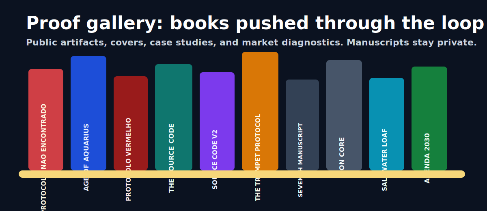

<div align="center">


# Book Genesis Bestseller Skills Suite

### Build, edit, stress-test, and package commercial books with repo-aware AI agents.

[](LICENSE)
[](#use-it-with-any-agent)
[](#bestseller-skills-suite)
[](#quality-gates)


</div>

---

## What It Is

**Book Genesis Bestseller Skills Suite** is an open-source AI book studio for file-aware agents.

It is not a single prompt, SaaS wrapper, or writing gimmick. It is a reproducible system of skills, scoring rules, project files, review gates, and editorial deliverables that lets an AI agent behave like a book production team:

- researcher
- architect
- writer
- developmental editor
- copyeditor
- literary-agent panel
- reader-swarm simulator
- humanizer
- editorial packager

The core promise:

> Turn an idea or messy manuscript into a structured, scored, revised, market-aware book package.

## Why It Exists

Most AI book workflows stop at "draft more text." Book Genesis does the harder parts:

- pressure-test the premise;
- build durable project state;
- compare against market expectations;
- revise by weakest dimension;
- run simulated agent/editor/reader panels;
- produce submission-ready editorial materials;
- keep evidence files so quality claims can be audited.

The system targets an internal **8.5+ editorial gate**. That is a quality target, not a bestseller guarantee.

---

## Bestseller Skills Suite

The current public suite includes 9 book-production skills.

| Skill | Job |
| --- | --- |
| `book-bestseller-studio` | Orchestrates the full commercial-readiness loop. |
| `book-genesis` | Builds the book project, structure, phase gates, scoring, and delivery flow. |
| `book-editor` | Applies developmental edits, pacing repair, scene surgery, and revision taxonomy. |
| `book-researcher` | Maps genre, comps, reader promises, market gaps, and positioning. |
| `literary-agent-panel` | Simulates agent, acquiring editor, bookseller, and target-reader review. |
| `book-swarm-panel` | Runs MiroFish-style clean-room reader swarms, heatmaps, and revision tickets. |
| `editorial-package` | Produces logline, query, synopsis, cover brief, ARC packet, and submission assets. |
| `copy-editing` | Tightens prose, grammar, clarity, consistency, and final polish. |
| `humanizer` | Removes mechanical texture and restores voice, cadence, and emotional specificity. |

Full suite notes: [`docs/bestseller-skills-suite.md`](docs/bestseller-skills-suite.md).

---

## Operating Loop

```text
idea or manuscript
-> market research
-> foundation and architecture
-> drafting or manuscript intake
-> developmental edit
-> humanizer pass
-> copyedit pass
-> literary-agent panel
-> MiroFish-style reader swarm
-> revision tickets
-> editorial package
-> beta / submission / launch prep
```

The important part is the loop:

```text
score below target
-> identify weakest dimension
-> revise that dimension
-> rerun panel or swarm
-> repeat until evidence supports the gate
```

---

## Quality Gates

Book Genesis separates hype from evidence.

| Gate | What It Checks |
| --- | --- |
| Genesis Score | Craft, structure, voice, market, pacing, opening, coherence. |
| Floor Rule | No major dimension can be hidden by a strong average. |
| Adversarial Audit | Hostile review before final score. |
| Agent Panel | Would agents, editors, booksellers, and target readers keep reading? |
| Swarm Panel | Simulated public reaction, niche-risk heatmap, and revision tickets. |
| Human Validation | Required for culture, religion, trauma, law, medicine, and protected communities. |

No simulated reader panel can certify real-world cultural approval. The suite produces diagnostic evidence, not magic.

---

## Use It With Any Agent

| Tool | How to run it | Status |
| --- | --- | --- |
| Claude Code | Install the skill folders and invoke the relevant skill. | Native multi-file skill workflow. |
| Codex | Open the repo and point Codex at `AGENTS.md`. | Native repo workflow. |
| Antigravity | Open the repo and follow `AGENTS.md`. | Portable file-backed workflow. |
| Kimi / other agents | Upload or expose the relevant `skills/` folder. | Markdown-based agent system. |

Codex-style instruction:

```text
Use Book Genesis. Read AGENTS.md. Then run the Bestseller Skills Suite on this book project.
Persist decisions to files. Do not skip adversarial audit, agent-panel review, or reader-swarm calibration.
```

Claude-style invocation:

```bash
/book-genesis-codex en "a literary thriller about an archivist who discovers every deleted manuscript is still being edited somewhere"
```

---

## Optional Local Runner

The runner does not call an LLM. It creates repeatable project folders, prepares phase packets, validates expected outputs, and advances gates.

```bash
python runner/cli.py init my-book --idea "a detective audits a haunted manuscript"
python runner/cli.py prepare-phase my-book
python runner/cli.py advance-phase my-book
python runner/cli.py prepare-swarm my-book --mode hybrid --slug launch-reaction
```

Mechanical demo:

```bash
python runner/cli.py demo .tmp-book-genesis-demo
python runner/cli.py status .tmp-book-genesis-demo
python runner/cli.py validate .tmp-book-genesis-demo
```

See [`docs/runner.md`](docs/runner.md).

---

## Proof Gallery



10+ book projects have been pushed through earlier versions of the system in under 30 days. Manuscripts stay private; this repo ships the pipeline, public artifacts, covers, diagnostics, and case studies.

| Case | Genre | Pipeline Note |
| --- | --- | --- |
| Protocolo Nao Encontrado | memoir / generational essay | early public case with strong external response |
| Age of Aquarius | speculative spiritual thriller | iterative scoring, sensitivity-risk gates, editorial package |
| Red Protocol | vigilante thriller | V4 to V5 calibration exposed score inflation and pacing limits |
| The Source Code | literary sci-fi thriller | long revision loops revealed diminishing returns |
| The Source Code v2 | sci-fi thriller rewrite | audit-first scoring proved safer than endless polishing |
| The Trumpet Protocol | apocalyptic literary thriller | custom theological-prophetic coherence dimension |
| The Seventh Manuscript | dark academia thriller | unreliable narration and meta-genre risk testing |
| Iron Core | LitRPG / dungeon core | genre-specific constraint design |
| The Saltwater Loaf | cozy mystery | fair-play clue system and cozy-market constraints |
| Agenda 2030 | apocalyptic sci-fi/fantasy | large-scale foundation calibration |

More: [`SHOWCASE.md`](SHOWCASE.md), [`docs/book-gallery.md`](docs/book-gallery.md), [`examples/cases/`](examples/cases/).

---

## What Changed In This Release

- Repositioned the repo as **Book Genesis Bestseller Skills Suite**.
- Added the full 9-skill commercial book studio.
- Added `literary-agent-panel`, `copy-editing`, and `humanizer`.
- Synced active local versions of `book-genesis`, `book-editor`, `book-swarm-panel`, and `book-bestseller-studio`.
- Added GitHub marketing visuals:
  - `assets/brand/bestseller-skills-banner.svg`
  - `assets/social/book-stack-showcase.svg`
- Added public suite documentation:
  - `docs/bestseller-skills-suite.md`

---

## Repository Map

```text
skills/book-genesis-codex/      current portable core
skills/book-bestseller-studio/  commercial-readiness orchestration
skills/book-swarm-panel/        MiroFish-style reader swarm diagnostics
skills/literary-agent-panel/    simulated agent/editor/bookseller panel
skills/book-editor/             developmental edit and revision surgery
skills/book-researcher/         market research and comp analysis
skills/editorial-package/       query, synopsis, cover brief, ARC package
skills/copy-editing/            final copy polish
skills/humanizer/               voice and cadence repair
agents/                         legacy autonomous orchestrator
knowledge/                      benchmark and craft references
docs/                           architecture, migration, scoring, portability
examples/                       public artifacts and case studies
assets/                         brand, cover, and social visuals
runner/                         optional local CLI
tests/                          smoke tests for the runner
```

---

## Installation

macOS / Linux:

```bash
./install.sh
```

Windows PowerShell:

```powershell
.\install.ps1
```

After installation, use the relevant skill folder from `skills/`.

---

## License

MIT. Use it, fork it, ship books with it.

If a manuscript ships because of Book Genesis, a credit in the colophon is appreciated, never required.

---

<div align="center">

**For writers who want a production loop, not a pile of drafts.**

[Read the docs](docs/) - [Browse the cases](SHOWCASE.md) - [Star on GitHub](https://github.com/felipelobomotta-blip/book-genesis-v4)

</div>
