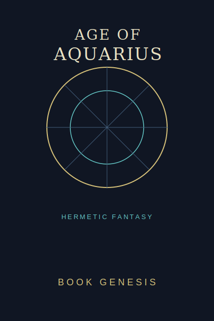
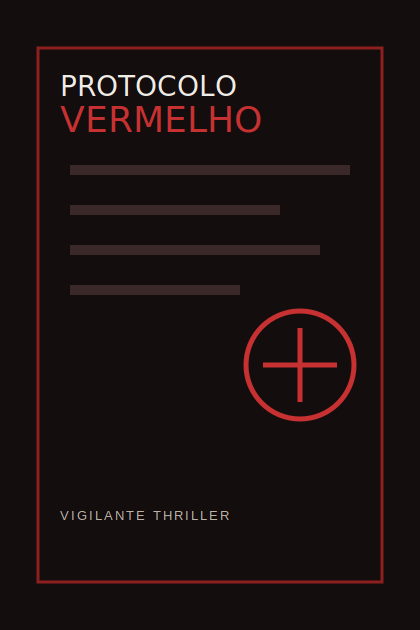
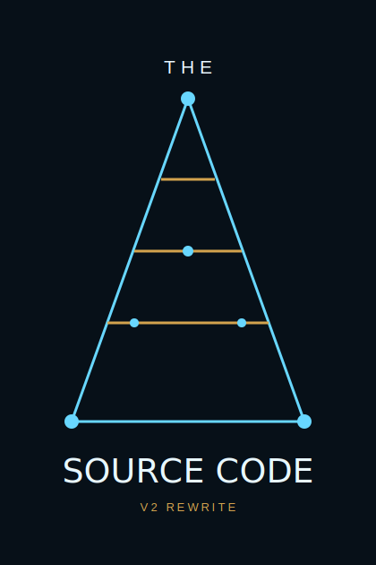
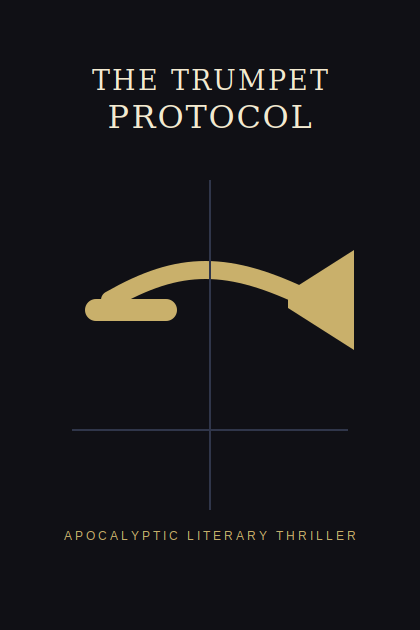
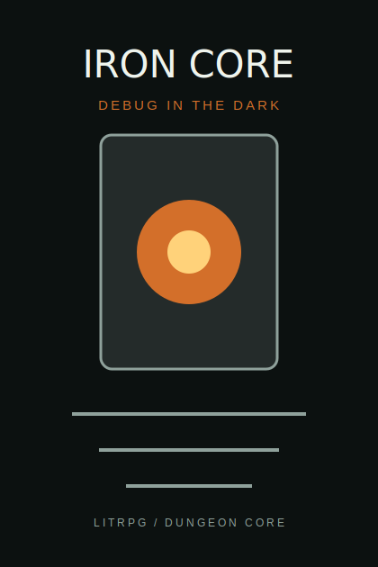
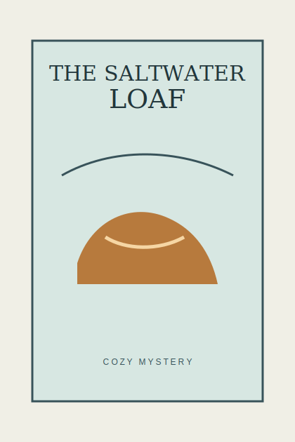
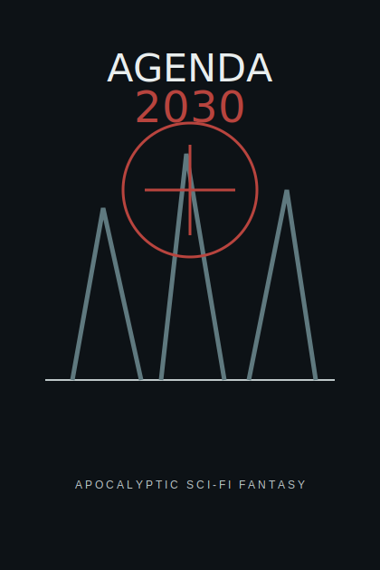

# Book Gallery

This gallery is the public proof layer for Book Genesis: 10 book projects pushed through the system in under 30 days, across memoir, fantasy, thriller, sci-fi, LitRPG, cozy mystery, and dark academia.

The manuscripts remain private. The repository shows covers, cover concepts, status, case notes, and process artifacts so people can evaluate the pipeline without requiring the books themselves to be open-sourced.

## Cover Wall

| | | | | |
|---|---|---|---|---|
|  |  |  |  |  |
| Protocolo Nao Encontrado | Age of Aquarius | Protocolo Vermelho | The Source Code | The Source Code v2 |
|  |  |  |  |  |
| The Trumpet Protocol | The Seventh Manuscript | Iron Core | The Saltwater Loaf | Agenda 2030 |

## Project Table

| Book | Genre | Language | Local status | Public asset |
|------|-------|----------|--------------|--------------|
| Protocolo Nao Encontrado | memoir / generational essay | PT-BR | completed artifact set | real cover + score + outline + synopses |
| Age of Aquarius | hermetic fantasy | EN | completed artifact set | cover concept + score + outline + synopses |
| Protocolo Vermelho | vigilante thriller | PT-BR | local manuscript/revision project | cover concept + case note |
| The Source Code | literary sci-fi thriller | EN | complete local manuscript + delivery package | real cover + case note |
| The Source Code v2 | literary sci-fi thriller rewrite | EN | local rewrite/revision project | cover concept + case note |
| The Trumpet Protocol | apocalyptic literary thriller | EN | local manuscript + delivery-stage state | cover concept + case note |
| The Seventh Manuscript | dark academia literary thriller | EN | local manuscript project | cover concept + case note |
| Iron Core | LitRPG / dungeon core | EN | local manuscript project | cover concept + case note |
| The Saltwater Loaf | cozy mystery | EN | local manuscript project | cover concept + case note |
| Agenda 2030 | apocalyptic sci-fi/fantasy | EN | local draft/project | cover concept + case note |

## Marketing Claim

Short version:

```text
10 book projects in under 30 days. The code is the pipeline.
```

More precise version:

```text
I used Book Genesis to push 10 book projects through planning, drafting, scoring, revision, packaging, or case-study stages in under 30 days. The repo includes the pipeline, the Codex port, and the public proof layer.
```

Use the precise version in technical communities. Use the short version on X/Twitter when a screenshot of the cover wall carries the nuance.

## Why Covers Matter

The Reddit/HN audience does not need the full manuscripts to understand the claim. They need enough proof that the system was used on real projects:

- covers or cover concepts
- score/evaluation artifacts
- project state summaries
- case notes showing what changed in the system
- a clear link from the result back to the code

That is what this gallery is for.
